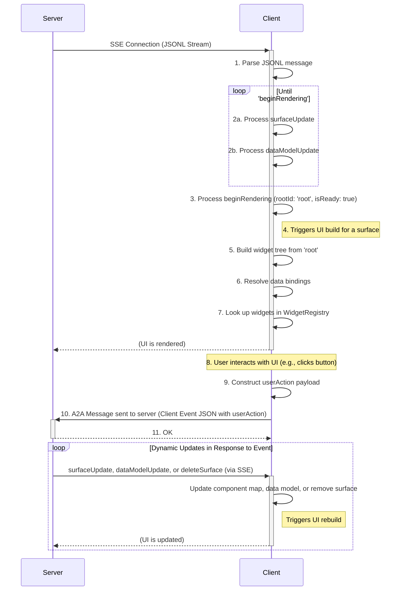
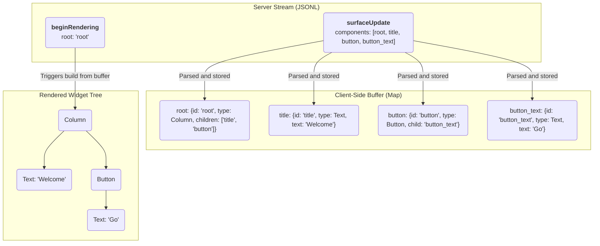

# A2UI (Agent to UI) Protocol

A Specification for a JSONL-Based, Streaming UI Protocol

Created: Sep 19, 2025

## Design Requirements

The A2UI (Agent to UI) protocol should be a system where an LLM can stream a platform-agnostic, abstract UI definition to a client, which then renders it progressively using a native widget set. Every major design choice is traced back to the core challenges of LLM generation, perceived performance, and platform independence.

### Requirement: The protocol must be easily generated by a Transformer Large Language Model (LLM)

This is the most critical driver. This requirement directly leads to several design choices:

Declarative, Simple Structure: The protocol should use a straightforward, declarative format ("this is a column with these children") rather than an imperative one ("now, add a column; then, append a text widget to it"). LLMs excel at generating structured, declarative data.

Flat Component List (Adjacency List): Requiring an LLM to generate a perfectly nested JSON tree in a single pass is difficult and error-prone. A flat list of components, where relationships are defined by simple string IDs, is much easier to generate piece by piece. The model can "think" of a component, give it an ID, and then reference that ID later without worrying about tree depth or object nesting.

Stateless Messages: Each JSONL message is a self-contained unit of information (componentUpdate, dataModelUpdate). This is ideal for a streaming LLM, which can output these messages incrementally as it processes a request.

### Requirement: The UI must render progressively for a fast, responsive user experience

The system must feel fast to the user, even if the full UI is complex and takes time to generate.

Streaming via JSONL/SSE: This is a direct solution. The client doesn't have to wait for a single, massive JSON payload. It can start receiving and processing UI components immediately, improving perceived performance.

### Requirement: The protocol must be platform-agnostic

The same server-side logic should be able to render a UI on a Flutter app, a web browser, or potentially other platforms without modification.

Client-Defined widget catalog: This is the core of the platform-agnostic design. The protocol should define an abstract component tree (e.g., "I need a Card with a Row inside"). It is the client's responsibility to map these abstract types to its native widget implementations (a Flutter Card widget, an HTML `<div>` with card styling, etc.). The server only needs to know the names of the components the client supports.

### Requirement: State management must be efficient and decoupled from the UI structure

Changing a piece of text in the UI should not require resending the entire UI definition.

Separation of Data and Components: Having distinct componentUpdate and data model update messages is key. The UI structure can be sent once, and subsequent updates can be small dataModelUpdate messages that only contain the changed data.

### Requirement: The communication architecture must be robust and scalable

The system needs a clear, reliable way to handle both server-pushed UI and client-initiated events.

Unidirectional UI Stream: Using a one-way stream (SSE) for UI updates simplifies the client's logic. It only needs to listen and react. This is a more robust pattern for server-push than trying to manage a complex bidirectional channel.

Event Handling: Event handling is done via an A2A message from the client to the server agent

## Introduction

The A2UI Protocol is a protocol designed for rendering user interfaces from a stream of JSON objects sent from a server. Its core philosophy emphasizes a clean separation of UI structure and application data, enabling progressive rendering as the client processes each message.

The protocol is designed to be "LLM-friendly," meaning its structure is declarative and straightforward, making it easy for a generative model to produce.

Communication occurs via a JSON Lines (JSONL) stream. The client parses each line as a distinct message and incrementally builds the UI. The server-to-client protocol defines four message types:

- `surfaceUpdate`: Provides a list of component definitions to be added to or updated in a specific UI area called a "surface."
- `dataModelUpdate`: Provides new data to be inserted into or to replace a surface's data model. Each surface has its own data model.
- `beginRendering`: Signals to the client that it has enough information to perform the initial render, specifying the ID of the root component.
- `deleteSurface`: Explicitly removes a surface and its contents from the UI.

Client-to-server communication for user interactions is handled separately via a JSON payload sent to a REST API. This message can be one of several types:

- `userAction`: Reports a user-initiated action from a component.
- `clientUiCapabilities`: Informs the server about the client's capabilities, such as the component catalog it supports.
- `error`: Reports a client-side error.
  This keeps the primary data stream unidirectional.

## Section 1: Foundational Architecture and Data Flow

This document specifies the architecture and data formats for the A2UI protocol. The design is guided by principles of strict separation of concerns, versioning, and progressive rendering.

### 1.1. Core Philosophy: Decoupling and Contracts

The central philosophy of A2UI is the decoupling of three key elements:

1.  **The Component Tree (The Structure):** A server-provided tree of abstract components that describes the UI's structure. This is defined by `surfaceUpdate` messages.
2.  **The Data Model (The State):** A server-provided JSON object containing the dynamic values that populate the UI, such as text, booleans, or lists. This is managed via `dataModelUpdate` messages.
3.  **The Widget Registry (The "Catalog"):** A client-defined mapping of component types (e.g., "Row", "Text") to concrete, native widget implementations. This registry is **part of the client application**, not the protocol stream. The server must generate components that the target client's registry understands.

### 1.2. The JSONL Stream: The Unit of Communication

All UI descriptions are transmitted from the server to the client as a stream of JSON objects, formatted as JSON Lines (JSONL). Each line is a separate, compact JSON object representing a single message. This allows the client to parse and process each part of the UI definition as it arrives, enabling progressive rendering.

### 1.3. Surfaces: Managing Multiple UI Regions

A **Surface** is a contiguous portion of screen real estate into which a A2UI UI can be rendered. The protocol introduces the concept of a `surfaceId` to uniquely identify and manage these areas. This allows a single A2UI stream to control multiple, independent UI regions simultaneously. Each surface has a separate root component and a separate hierarchy of components. Each surface has a separate data model, to avoid collision of keys when working with a large number of surfaces.

For example, in a chat application, each AI-generated response could be rendered into a separate surface within the conversation history. A separate, persistent surface could be used for a side panel that displays related information.

The `surfaceId` is a property within each server-to-client message that directs changes to the correct area. It is used with messages like `beginRendering`, `surfaceUpdate`, `dataModelUpdate`, and `deleteSurface` to target a specific surface.

### 1.4. Data Flow Model

The A2UI protocol is composed of a server-to-client stream describing UI and individual events sent to the server. The client consumes the stream, builds the UI, and renders it. Communication occurs via a JSON Lines (JSONL) stream, typically transported over **Server-Sent Events (SSE)**.

1.  **Server Stream:** The server begins sending the JSONL stream over an SSE connection.
2.  **Client-Side Buffering:** The client receives messages and buffers them:

    - `surfaceUpdate`: Component definitions are stored in a `Map<String, Component>`, organized by `surfaceId`. If a surface doesn't exist, it is created.
    - `dataModelUpdate`: The client's internal JSON data model is built or updated.

3.  **Render Signal:** The server sends a `beginRendering` message with the `root` component's ID. This prevents a "flash of incomplete content." The client buffers incoming components and data but waits for this explicit signal before attempting the first render, ensuring the initial view is coherent.
4.  **Client-Side Rendering:** The client, now in a "ready" state, starts at the `root` component. It recursively walks the component tree by looking up component IDs in its buffer. It resolves any data bindings against the data model and uses its `WidgetRegistry` to instantiate native widgets.
5.  **User Interaction and Event Handling:** The user interacts with a rendered widget (e.g., taps a button). The client constructs a `userAction` JSON payload, resolving any data bindings from the component's `action.context`. It sends this payload to the server via an A2A message.
6.  **Dynamic Updates:** The server processes the `userAction`. If the UI needs to change in response, the server sends new `surfaceUpdate` and `dataModelUpdate` messages over the original SSE stream. As these arrive, the client updates its component buffer and data model, and the UI re-renders to reflect the changes. The server can also send `deleteSurface` to remove a UI region.



### 1.5. Full Stream Example

The following is a complete, minimal example of a JSONL stream that renders a user profile card.

```jsonl
{"surfaceUpdate": {"components": [{"id": "root", "component": {"Column": {"children": {"explicitList": ["profile_card"]}}}}]}}
{"surfaceUpdate": {"components": [{"id": "profile_card", "component": {"Card": {"child": "card_content"}}}]}}
{"surfaceUpdate": {"components": [{"id": "card_content", "component": {"Column": {"children": {"explicitList": ["header_row", "bio_text"]}}}}]}}
{"surfaceUpdate": {"components": [{"id": "header_row", "component": {"Row": {"alignment": "center", "children": {"explicitList": ["avatar", "name_column"]}}}}]}}
{"surfaceUpdate": {"components": [{"id": "avatar", "component": {"Image": {"url": {"literalString": "[https://www.example.com/profile.jpg)"}}}}]}}
{"surfaceUpdate": {"components": [{"id": "name_column", "component": {"Column": {"alignment": "start", "children": {"explicitList": ["name_text", "handle_text"]}}}}]}}
{"surfaceUpdate": {"components": [{"id": "name_text", "component": {"Heading": {"level": "3", "text": {"literalString": "Flutter Fan"}}}}]}}
{"surfaceUpdate": {"components": [{"id": "handle_text", "component": {"Text": {"text": {"literalString": "@flutterdev"}}}}]}}
{"surfaceUpdate": {"components": [{"id": "bio_text", "component": {"Text": {"text": {"literalString": "Building beautiful apps from a single codebase."}}}}]}}
{"dataModelUpdate": {"contents": {}}}
{"beginRendering": {"root": "root"}}
```

## Section 2: The Component Model

A2UI's component model is designed for flexibility, separating the protocol from the component set.

### 2.1. The Catalog: Defining Components

Unlike previous versions with a fixed component set, A2UI now defines components in a **Catalog**. A catalog is a schema that defines the available component types (e.g., `Row`, `Text`) and their supported properties. This allows for different clients to support different sets of components, including custom ones. The server must generate `surfaceUpdate` messages that conform to the component catalog understood by the client. Clients can inform the server of the catalog they support using the `clientUiCapabilities` message.

### 2.2. The `surfaceUpdate` Message

This message is the primary way UI structure is defined. It contains a `surfaceId` and a `components` array.

```json
{
  "surfaceUpdate": {
    "surfaceId": "main_content_area",
    "components": [
      {
        "id": "unique-component-id",
        "component": {
          "Text": {
            "text": { "literalString": "Hello, World!" }
          }
        }
      },
      {
        "id": "another-component-id",
        "component": { ... }
      }
    ]
  }
}
```

- `components`: A required flat list of component instances.

### 2.3. The Component Object

Each object in the `components` array has the following structure:

- `id`: A required, unique string that identifies this specific component instance. This is used for parent-child references.
- `component`: A required object that defines the component's type and properties.

### 2.4.`component` (Generic Object)

On the wire, this object is generic. Its structure is not defined by the core A2UI protocol. Instead, its validation is based on the active **Catalog**. It is a wrapper object that **must** contain exactly one key, where the key is the string name of the component type from the catalog (e.g., `"Text"`, `"Row"`). The value is an object containing the properties for that component, as defined in the catalog.

**Example:** A `Text` component:

```json
"component": {
  "Text": {
    "text": { "literalString": "This is text" }
  }
}
```

A `Button` component:

```json
"component": {
  "Button": {
    "label": { "literalString": "Click Me" },
    "action": { "name": "submit_form" }
  }
}
```

The full set of available component types and their properties is defined by a **Catalog Schema**, not in the core protocol schema.

## Section 3: UI Composition

### 3.1. The Adjacency List Model

The A2UI protocol defines the UI as a flat list of components. The tree structure is built implicitly using ID references. This is known as an adjacency list model.

Container components (like `Row`, `Column`, `List`, `Card`) have properties that reference the `id` of their child component(s). The client is responsible for storing all components in a map (e.g., `Map<String, Component>`) and recreating the tree structure at render time.

This model allows the server to send component definitions in any order, as long as all necessary components are present by the time `beginRendering` is sent.



### 3.2. Container Children: `explicitList` vs. `template`

Container components (`Row`, `Column`, `List`) define their children using a `children` object, which must contain _either_ `explicitList` or `template`.

- `explicitList`: An array of component `id` strings. This is used for static, known children.
- `template`: An object used to render a dynamic list of children from a data-bound list.

```json
// Example: Children property from a2ui_schema.json
"children": {
  "description": "Defines the children... You MUST define EITHER 'explicitList' OR 'template'",
  "properties": {
    "explicitList": {
      "type": "array",
      "items": { "type": "string" }
    },
    "template": {
      "type": "object",
      "properties": {
        "componentId": { "type": "string" },
        "dataBinding": { "type": "string" }
      },
      "required": ["componentId", "dataBinding"]
    }
  }
}
```

### 3.3. Dynamic List Rendering with `template`

To render dynamic lists, a container uses the `template` property.

1.  `dataBinding`: A path to a list in the data model (e.g., `/user/posts`).
2.  `componentId`: The `id` of another component in the buffer to use as a template for each item in the list.

The client will iterate over the list at `dataBinding` and, for each item, render the component specified by `componentId`. The item's data is made available to the template component for relative data binding.

## Section 4: Dynamic Data & State Management

A2UI enforces a clean separation between the UI's structure (components) and its dynamic data (data model).

### 4.1. The `dataModelUpdate` Message

This message is the only way to modify the client's data model.

- `surfaceId`: The unique identifier for the UI surface this data model update applies to.
- `path`: An optional path to a location within the data model (e.g., '/user/name'). If omitted, the update applies to the root of the data model.
- `contents`: An array of data entries arranged as an adjacency list. Each entry must contain a 'key' and exactly one corresponding typed 'value\*' property (e.g. `valueString`, `valueNumber`, `valueBoolean`, `valueMap`).
  - `valueMap`: A JSON object representing a map as an adjacency list.

#### Example: Updating the data model

```json
{
  "dataModelUpdate": {
    "surfaceId": "main_content_area",
    "path": "user",
    "contents": [
      { "key": "name", "valueString": "Bob" },
      { "key": "isVerified", "valueBoolean": true },
      {
        "key": "address",
        "valueMap": [
          { "key": "street", "valueString": "123 Main St" },
          { "key": "city", "valueString": "Anytown" }
        ]
      }
    ]
  }
}
```

### 4.2. Data Binding (The `BoundValue` Object)

Components connect to the data model through binding. Any property that can be data-bound (like `text` on a `Text` component) accepts a `BoundValue` object. This object defines either a literal value, a data path, or both as a shorthand for initialization.

From the catalog schema, a bound `text` property looks like this:

```json
"text": {
  "properties": {
    "path": { "type": "string" },
    "literalString": { "type": "string" }
  }
}
```

A component can also bind to numbers (`literalNumber`), booleans (`literalBoolean`), or arrays (`literalArray`). The behavior depends on which properties are provided:

- **Literal Value Only**: If only a `literal*` value (e.g., `literalString`) is provided, the value is static and displayed directly.

  ```json
  "text": { "literalString": "Hello" }
  ```

- **Path Only**: If only `path` is provided, the value is dynamic. It's resolved from the data model at render time.

  ```json
  "text": { "path": "/user/name" }
  ```

- **Path and Literal Value (Initialization Shorthand)**: If **both** `path` and a `literal*` value are provided, it serves as a shorthand for data model initialization. The client MUST:

  1.  Update the data model at the specified `path` with the provided `literal*` value. This is an implicit `dataModelUpdate`.
  2.  Bind the component property to that `path` for rendering and future updates.

  This allows the server to set a default value and bind to it in a single step.

  ```json
  // This initializes data model at '/user/name' to "Guest" and binds to it.
  "text": { "path": "/user/name", "literalString": "Guest" }
  ```

The client's interpreter is responsible for resolving these paths against the data model before rendering. The A2UI protocol supports direct 1:1 binding; it does not include transformers (e.g., formatters, conditionals). Any data transformation must be performed by the server before sending it in a `dataModelUpdate`.

## Section 5: Event Handling

While the server-to-client UI definition is a one-way stream (e.g., over SSE), user interactions are communicated back to the server using an A2A message.

### 5.1. The Client Event Message

The client sends a single JSON object that acts as a wrapper. It must contain exactly one of the following keys: `userAction`, `clientUiCapabilities`, or `error`.

### 5.2. The `userAction` Message

This message is sent when the user interacts with a component that has an action defined. It is the primary mechanism for user-driven events.

The `userAction` object has the following structure:

- `name` (string, required): The name of the action, taken directly from the `action.name` property of the component (e.g., "submit_form").
- `surfaceId` (string, required): The `id` of the surface where the event originated.
- `sourceComponentId` (string, required): The `id` of the component that triggered the event (e.g., "my_button").
- `timestamp` (string, required): An ISO 8601 timestamp of when the event occurred (e.g., "2025-09-19T17:01:00Z").
- `context` (object, required): A JSON object containing the key-value pairs from the component's `action.context`, after resolving all `BoundValue`s against the data model.

The process for resolving the `action.context` remains the same: the client iterates over the `context` array, resolves all literal or data-bound values, and constructs the `context` object.

### 5.3. The `clientUiCapabilities` Message

This message is sent by the client to inform the server about its capabilities. This is crucial for supporting different component sets, allowing the server to generate UI that is compatible with the client. The message must contain exactly one of the following properties: `catalogUri` or `dynamicCatalog`.

- `catalogUri`: A URI pointing to a predefined component catalog schema that the client supports.
- `dynamicCatalog`: An inline JSON object, conforming to the Catalog Schema, that defines the client's supported components. This is useful for development or for clients with highly custom component sets.

#### `dynamicCatalog`

The `dynamicCatalog` property allows the client to send an inline JSON object that defines its entire supported component set. This is especially useful for development or for clients with highly custom components. The object must conform to the Catalog Schema, containing `components`.

- `components`: An object where each key is the name of a component (e.g., `"MyCustomCard"`) and the value is a valid JSON object schema defining the properties for that component.

**Example of a `clientUiCapabilities` message with a dynamic catalog:**

```json
{
  "clientUiCapabilities": {
    "dynamicCatalog": {
      "components": {
        "StatusPill": {
          "type": "object",
          "properties": {
            "text": { "$ref": "#/definitions/BoundValue" },
            "statusColor": { "type": "string" }
          },
          "required": ["text", "statusColor"]
        }
      }
    }
  }
}
```

### 5.4. The `error` Message

This message provides a feedback mechanism for the server. It is sent when the client encounters an error, for instance, during UI rendering or data binding. The content of the object is flexible and can contain any relevant error information.

### 5.5. Event Flow Example (`userAction`)

1.  **Component Definition** (from `surfaceUpdate`):

    ```json
    {
      "surfaceUpdate": {
        "surfaceId": "main_content_area",
        "components": [
          {
            "id": "submit_btn_text",
            "component": {
              "Text": {
                "text": { "literalString": "Submit" }
              }
            }
          },
          {
            "id": "submit_btn",
            "component": {
              "Button": {
                "child": "submit_btn_text",
                "action": {
                  "name": "submit_form",
                  "context": [
                    {
                      "key": "userInput",
                      "value": { "path": "/form/textField" }
                    },
                    { "key": "formId", "value": { "literalString": "f-123" } }
                  ]
                }
              }
            }
          }
        ]
      }
    }
    ```

2.  **Data Model** (from `dataModelUpdate`):

    ```json
    {
      "dataModelUpdate": {
        "surfaceId": "main_content_area",
        "path": "form",
        "contents": [{ "key": "textField", "valueString": "User input text" }]
      }
    }
    ```

3.  **User Action:** The user taps the "submit_btn" button.
4.  **Client-Side Resolution:** The client resolves the `action.context`.
5.  **Client-to-Server Request:** The client sends a `POST` request to `https://api.example.com/handle_event` with the following JSON body:

    ```json
    {
      "userAction": {
        "name": "submit_form",
        "surfaceId": "main_content_area",
        "sourceComponentId": "submit_btn",
        "timestamp": "2025-09-19T17:05:00Z",
        "context": {
          "userInput": "User input text",
          "formId": "f-123"
        }
      }
    }
    ```

6.  **Server Response:** The server processes this event. If the UI needs to change as a result, the server sends new `surfaceUpdate` or `dataModelUpdate` messages over the **separate SSE stream**.

## Section 6: Client-Side Implementation

A robust client-side interpreter for A2UI should be composed of several key components:

- **JSONL Parser:** A parser capable of reading the stream line by line and decoding each line as a separate JSON object.
- **Message Dispatcher:** A mechanism (e.g., a `switch` statement) to identify the message type (`beginRendering`, `surfaceUpdate`, etc.) and route it to the correct handler.
- **Component Buffer:** A `Map<String, Component>` that stores all component instances by their `id`. This is populated by `componentUpdate` messages.
- **Data Model Store:** A `Map<String, dynamic>` (or similar) that holds the application state. This is built and modified by `dataModelUpdate` messages.
- **Interpreter State:** A state machine to track if the client is ready to render (e.g., a `_isReadyToRender` boolean that is set to `true` by `beginRendering`).
- **Widget Registry**: A developer-provided map (e.g., `Map<String, WidgetBuilder>`) that associates component type strings ("Row", "Text") with functions that build native widgets.
- **Binding Resolver:** A utility that can take a `BoundValue` (e.g., `{ "path": "/user/name" }`) and resolve it against the Data Model Store.
- **Surface Manager:** Logic to create, update, and delete UI surfaces based on `surfaceId`.
- **Event Handler:** A function, exposed to the `WidgetRegistry`, that constructs and sends the client event message (e.g., `userAction`) to the configured REST API endpoint.

## Section 7: Complete A2UI Server To Client JSON Schema

This section provides the formal JSON Schema for a single server-to-client message in the A2UI JSONL stream. Each line in the stream must be a valid JSON object that conforms to this schema. It includes the entire base catalog of components, but the components may be swapped out for other components supported by the client. It is optimized to be able to be generated in structured output mode from various LLMs.

```json
{
  "title": "A2UI Message Schema",
  "description": "Describes a JSON payload for an A2UI (Agent to UI) message, which is used to dynamically construct and update user interfaces. A message MUST contain exactly ONE of the action properties: 'beginRendering', 'surfaceUpdate', 'dataModelUpdate', or 'deleteSurface'.",
  "type": "object",
  "properties": {
    "beginRendering": {
      "type": "object",
      "description": "Signals the client to begin rendering a surface with a root component and specific styles.",
      "properties": {
        "surfaceId": {
          "type": "string",
          "description": "The unique identifier for the UI surface to be rendered."
        },
        "root": {
          "type": "string",
          "description": "The ID of the root component to render."
        },
        "styles": {
          "type": "object",
          "description": "Styling information for the UI.",
          "properties": {
            "font": {
              "type": "string",
              "description": "The primary font for the UI."
            },
            "primaryColor": {
              "type": "string",
              "description": "The primary UI color as a hexadecimal code (e.g., '#00BFFF').",
              "pattern": "^#[0-9a-fA-F]{6}$"
            }
          }
        }
      },
      "required": ["root", "surfaceId"]
    },
    "surfaceUpdate": {
      "type": "object",
      "description": "Updates a surface with a new set of components.",
      "properties": {
        "surfaceId": {
          "type": "string",
          "description": "The unique identifier for the UI surface to be updated. If you are adding a new surface this *must* be a new, unique identified that has never been used for any existing surfaces shown."
        },
        "components": {
          "type": "array",
          "description": "A list containing all UI components for the surface.",
          "minItems": 1,
          "items": {
            "type": "object",
            "description": "Represents a *single* component in a UI widget tree. This component could be one of many supported types.",
            "properties": {
              "id": {
                "type": "string",
                "description": "The unique identifier for this component."
              },
              "weight": {
                "type": "number",
                "description": "The relative weight of this component within a Row or Column. This corresponds to the CSS 'flex-grow' property. Note: this may ONLY be set when the component is a direct descendant of a Row or Column."
              },
              "component": {
                "type": "object",
                "description": "A wrapper object that MUST contain exactly one key, which is the name of the component type (e.g., 'Heading'). The value is an object containing the properties for that specific component.",
                "properties": {
                  "Heading": {
                    "type": "object",
                    "properties": {
                      "text": {
                        "type": "object",
                        "description": "The text content for the heading. This can be a literal string or a reference to a value in the data model ('path', e.g. 'doc.title').",
                        "properties": {
                          "literalString": {
                            "type": "string"
                          },
                          "path": {
                            "type": "string"
                          }
                        }
                      },
                      "level": {
                        "type": "string",
                        "description": "The heading level, corresponding to HTML heading tags (e.g., '1' for <h1>, '2' for <h2>).",
                        "enum": ["1", "2", "3", "4", "5"]
                      }
                    },
                    "required": ["text"]
                  },
                  "Text": {
                    "type": "object",
                    "properties": {
                      "text": {
                        "type": "object",
                        "description": "The text content to display. This can be a literal string or a reference to a value in the data model ('path', e.g. 'hotel.description').",
                        "properties": {
                          "literalString": {
                            "type": "string"
                          },
                          "path": {
                            "type": "string"
                          }
                        }
                      }
                    },
                    "required": ["text"]
                  },
                  "Image": {
                    "type": "object",
                    "properties": {
                      "url": {
                        "type": "object",
                        "description": "The URL of the image to display. This can be a literal string ('literal') or a reference to a value in the data model ('path', e.g. 'thumbnail.url').",
                        "properties": {
                          "literalString": {
                            "type": "string"
                          },
                          "path": {
                            "type": "string"
                          }
                        }
                      },
                      "fit": {
                        "type": "string",
                        "description": "Specifies how the image should be resized to fit its container. This corresponds to the CSS 'object-fit' property.",
                        "enum": [
                          "contain",
                          "cover",
                          "fill",
                          "none",
                          "scale-down"
                        ]
                      }
                    },
                    "required": ["url"]
                  },
                  "Icon": {
                    "type": "object",
                    "properties": {
                      "name": {
                        "type": "object",
                        "description": "The name of the icon to display. This can be a literal string ('literal') or a reference to a value in the data model ('path', e.g. 'icon.name').",
                        "properties": {
                          "literalString": {
                            "type": "string"
                          },
                          "path": {
                            "type": "string"
                          }
                        }
                      }
                    },
                    "required": ["name"]
                  },
                  "Video": {
                    "type": "object",
                    "properties": {
                      "url": {
                        "type": "object",
                        "description": "The URL of the video to display. This can be a literal string or a reference to a value in the data model ('path', e.g. 'video.url').",
                        "properties": {
                          "literalString": {
                            "type": "string"
                          },
                          "path": {
                            "type": "string"
                          }
                        }
                      }
                    },
                    "required": ["url"]
                  },
                  "AudioPlayer": {
                    "type": "object",
                    "properties": {
                      "url": {
                        "type": "object",
                        "description": "The URL of the audio to be played. This can be a literal string ('literal') or a reference to a value in the data model ('path', e.g. 'song.url').",
                        "properties": {
                          "literalString": {
                            "type": "string"
                          },
                          "path": {
                            "type": "string"
                          }
                        }
                      },
                      "description": {
                        "type": "object",
                        "description": "A description of the audio, such as a title or summary. This can be a literal string or a reference to a value in the data model ('path', e.g. 'song.title').",
                        "properties": {
                          "literalString": {
                            "type": "string"
                          },
                          "path": {
                            "type": "string"
                          }
                        }
                      }
                    },
                    "required": ["url"]
                  },
                  "Row": {
                    "type": "object",
                    "properties": {
                      "children": {
                        "type": "object",
                        "description": "Defines the children. Use 'explicitList' for a fixed set of children, or 'template' to generate children from a data list.",
                        "properties": {
                          "explicitList": {
                            "type": "array",
                            "items": {
                              "type": "string"
                            }
                          },
                          "template": {
                            "type": "object",
                            "description": "A template for generating a dynamic list of children from a data model list. `componentId` is the component to use as a template, and `dataBinding` is the path to the map of components in the data model. Values in the map will define the list of children.",
                            "properties": {
                              "componentId": {
                                "type": "string"
                              },
                              "dataBinding": {
                                "type": "string"
                              }
                            },
                            "required": ["componentId", "dataBinding"]
                          }
                        }
                      },
                      "distribution": {
                        "type": "string",
                        "description": "Defines the arrangement of children along the main axis (horizontally). This corresponds to the CSS 'justify-content' property.",
                        "enum": [
                          "center",
                          "end",
                          "spaceAround",
                          "spaceBetween",
                          "spaceEvenly",
                          "start"
                        ]
                      },
                      "alignment": {
                        "type": "string",
                        "description": "Defines the alignment of children along the cross axis (vertically). This corresponds to the CSS 'align-items' property.",
                        "enum": ["start", "center", "end", "stretch"]
                      }
                    },
                    "required": ["children"]
                  },
                  "Column": {
                    "type": "object",
                    "properties": {
                      "children": {
                        "type": "object",
                        "description": "Defines the children. Use 'explicitList' for a fixed set of children, or 'template' to generate children from a data list.",
                        "properties": {
                          "explicitList": {
                            "type": "array",
                            "items": {
                              "type": "string"
                            }
                          },
                          "template": {
                            "type": "object",
                            "description": "A template for generating a dynamic list of children from a data model list. `componentId` is the component to use as a template, and `dataBinding` is the path to the map of components in the data model. Values in the map will define the list of children.",
                            "properties": {
                              "componentId": {
                                "type": "string"
                              },
                              "dataBinding": {
                                "type": "string"
                              }
                            },
                            "required": ["componentId", "dataBinding"]
                          }
                        }
                      },
                      "distribution": {
                        "type": "string",
                        "description": "Defines the arrangement of children along the main axis (vertically). This corresponds to the CSS 'justify-content' property.",
                        "enum": [
                          "start",
                          "center",
                          "end",
                          "spaceBetween",
                          "spaceAround",
                          "spaceEvenly"
                        ]
                      },
                      "alignment": {
                        "type": "string",
                        "description": "Defines the alignment of children along the cross axis (horizontally). This corresponds to the CSS 'align-items' property.",
                        "enum": ["center", "end", "start", "stretch"]
                      }
                    },
                    "required": ["children"]
                  },
                  "List": {
                    "type": "object",
                    "properties": {
                      "children": {
                        "type": "object",
                        "description": "Defines the children. Use 'explicitList' for a fixed set of children, or 'template' to generate children from a data list.",
                        "properties": {
                          "explicitList": {
                            "type": "array",
                            "items": {
                              "type": "string"
                            }
                          },
                          "template": {
                            "type": "object",
                            "description": "A template for generating a dynamic list of children from a data model list. `componentId` is the component to use as a template, and `dataBinding` is the path to the map of components in the data model. Values in the map will define the list of children.",
                            "properties": {
                              "componentId": {
                                "type": "string"
                              },
                              "dataBinding": {
                                "type": "string"
                              }
                            },
                            "required": ["componentId", "dataBinding"]
                          }
                        }
                      },
                      "direction": {
                        "type": "string",
                        "description": "The direction in which the list items are laid out.",
                        "enum": ["vertical", "horizontal"]
                      },
                      "alignment": {
                        "type": "string",
                        "description": "Defines the alignment of children along the cross axis.",
                        "enum": ["start", "center", "end", "stretch"]
                      }
                    },
                    "required": ["children"]
                  },
                  "Card": {
                    "type": "object",
                    "properties": {
                      "child": {
                        "type": "string",
                        "description": "The ID of the component to be rendered inside the card."
                      }
                    },
                    "required": ["child"]
                  },
                  "Tabs": {
                    "type": "object",
                    "properties": {
                      "tabItems": {
                        "type": "array",
                        "description": "An array of objects, where each object defines a tab with a title and a child component.",
                        "items": {
                          "type": "object",
                          "properties": {
                            "title": {
                              "type": "object",
                              "description": "The tab title. Defines the value as either a literal value or a path to data model value (e.g. 'options.title').",
                              "properties": {
                                "literalString": {
                                  "type": "string"
                                },
                                "path": {
                                  "type": "string"
                                }
                              }
                            },
                            "child": {
                              "type": "string"
                            }
                          },
                          "required": ["title", "child"]
                        }
                      }
                    },
                    "required": ["tabItems"]
                  },
                  "Divider": {
                    "type": "object",
                    "properties": {
                      "axis": {
                        "type": "string",
                        "description": "The orientation of the divider.",
                        "enum": ["horizontal", "vertical"]
                      }
                    }
                  },
                  "Modal": {
                    "type": "object",
                    "properties": {
                      "entryPointChild": {
                        "type": "string",
                        "description": "The ID of the component that opens the modal when interacted with (e.g., a button)."
                      },
                      "contentChild": {
                        "type": "string",
                        "description": "The ID of the component to be displayed inside the modal."
                      }
                    },
                    "required": ["entryPointChild", "contentChild"]
                  },
                  "Button": {
                    "type": "object",
                    "properties": {
                      "child": {
                        "type": "string",
                        "description": "The ID of the component to display in the button, typically a Text component."
                      },
                      "action": {
                        "type": "object",
                        "description": "The client-side action to be dispatched when the button is clicked. It includes the action's name and an optional context payload.",
                        "properties": {
                          "name": {
                            "type": "string"
                          },
                          "context": {
                            "type": "array",
                            "items": {
                              "type": "object",
                              "properties": {
                                "key": {
                                  "type": "string"
                                },
                                "value": {
                                  "type": "object",
                                  "description": "Defines the value to be included in the context as either a literal value or a path to a data model value (e.g. 'user.name').",
                                  "properties": {
                                    "path": {
                                      "type": "string"
                                    },
                                    "literalString": {
                                      "type": "string"
                                    },
                                    "literalNumber": {
                                      "type": "number"
                                    },
                                    "literalBoolean": {
                                      "type": "boolean"
                                    }
                                  }
                                }
                              },
                              "required": ["key", "value"]
                            }
                          }
                        },
                        "required": ["name"]
                      }
                    },
                    "required": ["child", "action"]
                  },
                  "CheckBox": {
                    "type": "object",
                    "properties": {
                      "label": {
                        "type": "object",
                        "description": "The text to display next to the checkbox. Defines the value as either a literal value or a path to data model ('path', e.g. 'option.label').",
                        "properties": {
                          "literalString": {
                            "type": "string"
                          },
                          "path": {
                            "type": "string"
                          }
                        }
                      },
                      "value": {
                        "type": "object",
                        "description": "The current state of the checkbox (true for checked, false for unchecked). This can be a literal boolean ('literalBoolean') or a reference to a value in the data model ('path', e.g. 'filter.open').",
                        "properties": {
                          "literalBoolean": {
                            "type": "boolean"
                          },
                          "path": {
                            "type": "string"
                          }
                        }
                      }
                    },
                    "required": ["label", "value"]
                  },
                  "TextField": {
                    "type": "object",
                    "properties": {
                      "label": {
                        "type": "object",
                        "description": "The text label for the input field. This can be a literal string or a reference to a value in the data model ('path, e.g. 'user.name').",
                        "properties": {
                          "literalString": {
                            "type": "string"
                          },
                          "path": {
                            "type": "string"
                          }
                        }
                      },
                      "text": {
                        "type": "object",
                        "description": "The value of the text field. This can be a literal string or a reference to a value in the data model ('path', e.g. 'user.name').",
                        "properties": {
                          "literalString": {
                            "type": "string"
                          },
                          "path": {
                            "type": "string"
                          }
                        }
                      },
                      "textFieldType": {
                        "type": "string",
                        "description": "The type of input field to display.",
                        "enum": [
                          "date",
                          "longText",
                          "number",
                          "shortText",
                          "obscured"
                        ]
                      },
                      "validationRegexp": {
                        "type": "string",
                        "description": "A regular expression used for client-side validation of the input."
                      }
                    },
                    "required": ["label"]
                  },
                  "DateTimeInput": {
                    "type": "object",
                    "properties": {
                      "value": {
                        "type": "object",
                        "description": "The selected date and/or time value. This can be a literal string ('literalString') or a reference to a value in the data model ('path', e.g. 'user.dob').",
                        "properties": {
                          "literalString": {
                            "type": "string"
                          },
                          "path": {
                            "type": "string"
                          }
                        }
                      },
                      "enableDate": {
                        "type": "boolean",
                        "description": "If true, allows the user to select a date."
                      },
                      "enableTime": {
                        "type": "boolean",
                        "description": "If true, allows the user to select a time."
                      },
                      "outputFormat": {
                        "type": "string",
                        "description": "The desired format for the output string after a date or time is selected."
                      }
                    },
                    "required": ["value"]
                  },
                  "MultipleChoice": {
                    "type": "object",
                    "properties": {
                      "selections": {
                        "type": "object",
                        "description": "The currently selected values for the component. This can be a literal array of strings or a path to an array in the data model('path', e.g. 'hotel.options').",
                        "properties": {
                          "literalArray": {
                            "type": "array",
                            "items": {
                              "type": "string"
                            }
                          },
                          "path": {
                            "type": "string"
                          }
                        }
                      },
                      "options": {
                        "type": "array",
                        "description": "An array of available options for the user to choose from.",
                        "items": {
                          "type": "object",
                          "properties": {
                            "label": {
                              "type": "object",
                              "description": "The text to display for this option. This can be a literal string or a reference to a value in the data model (e.g. 'option.label').",
                              "properties": {
                                "literalString": {
                                  "type": "string"
                                },
                                "path": {
                                  "type": "string"
                                }
                              }
                            },
                            "value": {
                              "type": "string",
                              "description": "The value to be associated with this option when selected."
                            }
                          },
                          "required": ["label", "value"]
                        }
                      },
                      "maxAllowedSelections": {
                        "type": "integer",
                        "description": "The maximum number of options that the user is allowed to select."
                      }
                    },
                    "required": ["selections", "options"]
                  },
                  "Slider": {
                    "type": "object",
                    "properties": {
                      "value": {
                        "type": "object",
                        "description": "The current value of the slider. This can be a literal number ('literalNumber') or a reference to a value in the data model ('path', e.g. 'restaurant.cost').",
                        "properties": {
                          "literalNumber": {
                            "type": "number"
                          },
                          "path": {
                            "type": "string"
                          }
                        }
                      },
                      "minValue": {
                        "type": "number",
                        "description": "The minimum value of the slider."
                      },
                      "maxValue": {
                        "type": "number",
                        "description": "The maximum value of the slider."
                      }
                    },
                    "required": ["value"]
                  }
                }
              }
            },
            "required": ["id", "component"]
          }
        }
      },
      "required": ["surfaceId", "components"]
    },
    "dataModelUpdate": {
      "type": "object",
      "description": "Updates the data model for a surface.",
      "properties": {
        "surfaceId": {
          "type": "string",
          "description": "The unique identifier for the UI surface this data model update applies to."
        },
        "path": {
          "type": "string",
          "description": "An optional path to a location within the data model (e.g., '/user/name'). If omitted, or set to '/', the entire data model will be replaced."
        },
        "contents": {
          "type": "array",
          "description": "An array of data entries. Each entry must contain a 'key' and exactly one corresponding typed 'value*' property.",
          "items": {
            "type": "object",
            "description": "A single data entry. Exactly one 'value*' property should be provided alongside the key.",
            "properties": {
              "key": {
                "type": "string",
                "description": "The key for this data entry."
              },
              "valueString": {
                "type": "string"
              },
              "valueNumber": {
                "type": "number"
              },
              "valueBoolean": {
                "type": "boolean"
              },
              "valueMap": {
                "description": "Represents a map as an adjacency list.",
                "type": "array",
                "items": {
                  "type": "object",
                  "description": "One entry in the map. Exactly one 'value*' property should be provided alongside the key.",
                  "properties": {
                    "key": {
                      "type": "string"
                    },
                    "valueString": {
                      "type": "string"
                    },
                    "valueNumber": {
                      "type": "number"
                    },
                    "valueBoolean": {
                      "type": "boolean"
                    }
                  },
                  "required": ["key"]
                }
              }
            },
            "required": ["key"]
          }
        }
      },
      "required": ["contents", "surfaceId"]
    },
    "deleteSurface": {
      "type": "object",
      "description": "Signals the client to delete the surface identified by 'surfaceId'.",
      "properties": {
        "surfaceId": {
          "type": "string",
          "description": "The unique identifier for the UI surface to be deleted."
        }
      },
      "required": ["surfaceId"]
    }
  }
}
```

## Section 8: Client-to-Server JSON Schema

This section provides the formal JSON Schema for the client-to-server event message. The client sends a single JSON object that must conform to this schema. This doesn’t have to be generated by an LLM, so it can include JSON schema elements that are incompatible with structured output.

```json
{
  "title": "A2UI Client-to-Server Event Schema",
  "description": "Describes a JSON payload for a client-to-server event message.",
  "type": "object",
  "minProperties": 1,
  "maxProperties": 1,
  "properties": {
    "userAction": {
      "type": "object",
      "description": "Reports a user-initiated action from a component.",
      "properties": {
        "name": {
          "type": "string",
          "description": "The name of the action, taken from the component's action.name property."
        },
        "surfaceId": {
          "type": "string",
          "description": "The id of the surface where the event originated."
        },
        "sourceComponentId": {
          "type": "string",
          "description": "The id of the component that triggered the event."
        },
        "timestamp": {
          "type": "string",
          "format": "date-time",
          "description": "An ISO 8601 timestamp of when the event occurred."
        },
        "context": {
          "type": "object",
          "description": "A JSON object containing the key-value pairs from the component's action.context, after resolving all data bindings.",
          "additionalProperties": true
        }
      },
      "required": [
        "name",
        "surfaceId",
        "sourceComponentId",
        "timestamp",
        "context"
      ]
    },
    "clientUiCapabilities": {
      "type": "object",
      "description": "Informs the server about the client's capabilities, such as the component catalog it supports. Exactly ONE of the properties in this object must be set.",
      "properties": {
        "catalogUri": {
          "type": "string",
          "format": "uri",
          "description": "A URI pointing to a predefined component catalog schema that the client supports."
        },
        "dynamicCatalog": {
          "type": "object",
          "description": "An inline JSON object that defines the client's supported components.",
          "properties": {
            "components": {
              "type": "object",
              "description": "A map where each key is a component name and the value is a JSON Schema defining an object containing its properties.",
              "additionalProperties": {
                "$ref": "https://json-schema.org/draft/2020-12/schema"
              }
            }
          },
          "required": ["components"]
        }
      },
      "oneOf": [
        { "required": ["catalogUri"] },
        { "required": ["dynamicCatalog"] }
      ]
    },
    "error": {
      "type": "object",
      "description": "Reports a client-side error. The content is flexible.",
      "additionalProperties": true
    }
  },
  "oneOf": [
    { "required": ["userAction"] },
    { "required": ["clientUiCapabilities"] },
    { "required": ["error"] }
  ]
}
```
